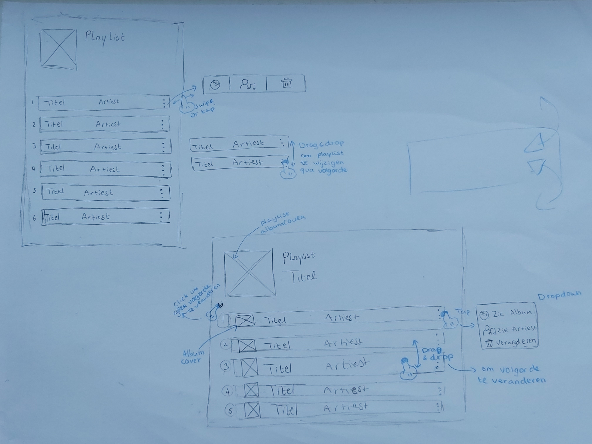

# Frontend voor Designers - opdracht 1: Een Micro-interactie uitwerken en testen

Ik heb gekozen voor de usecase "In een verzameling muzieknummers wil ik de volgorde kunnen veranderen om een playlist te maken voor een feest."

## Stap 1: Schetsen van de interactie

Eerst ben ik begonnen met een schets te maken van hoe ik dit voor me zou zien in een browser. Ik kwam al snel met het idee dat ik een playlist item wilde drag en droppen maar kreeg het advies om eerst met pijltjes te beginnen. 

