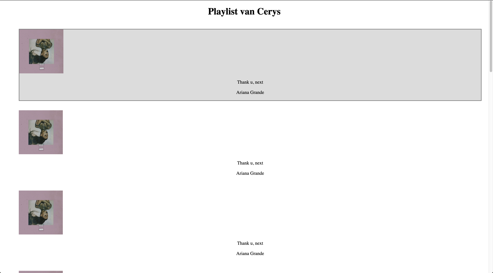
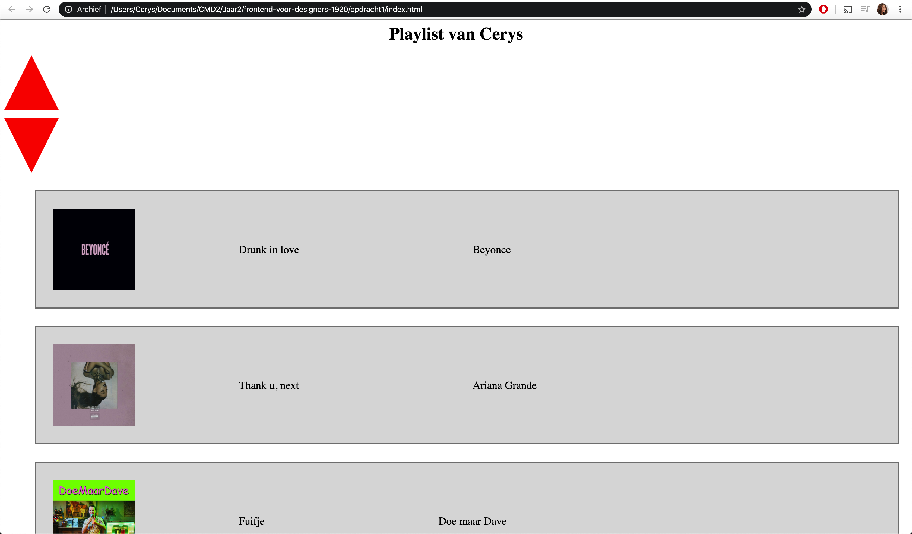

# Frontend voor Designers - opdracht 1: Een Micro-interactie uitwerken en testen

Ik heb gekozen voor de usecase "In een verzameling muzieknummers wil ik de volgorde kunnen veranderen om een playlist te maken voor een feest."

## Stap 1: Schetsen van de interactie

Eerst ben ik begonnen met een schets te maken van hoe ik dit voor me zou zien in een browser. Ik kwam al snel met het idee dat ik een playlist item wilde drag en droppen maar kreeg het advies om eerst met pijltjes te beginnen. 

Zoals te zien is op de schets had ik ook al ideeen voor een dropdown menu waar meerdere opties tevoorschijn zouden komen. Aangezien de opdracht "volgorde van nummers veranderen" is, heb ik dit in de daadwerkelijke versie weggelaten.

## stap 2: Opstellen van de html

Ik vond het wel weer wennen om html te gebruiken en had even de tijd nodig om de verschillende elementen te gebruiken. Door naar oude projecten te kijken verfriste ik mijn geheugen en kon ik een begin maken. Met behulp van Sanne heb ik een grid toegepast waardoor de playlist items onder elkaar verschijnen. Ik heb Ariana Grande even als placeholder gebruikt om mee te beginnen.

De basis van de html had ik hier wel rond. Ik heb wat classes toegevoegd/verwijderd toen ik begon met stijlen. Ik had in CSS met behulp van de website (https://css-tricks.com/the-shapes-of-css/ "css-tricks") pijlen gemaakt die ik kon gebruiken om de muzieknummers naar boven en/of naar beneden te verplaatsen.

