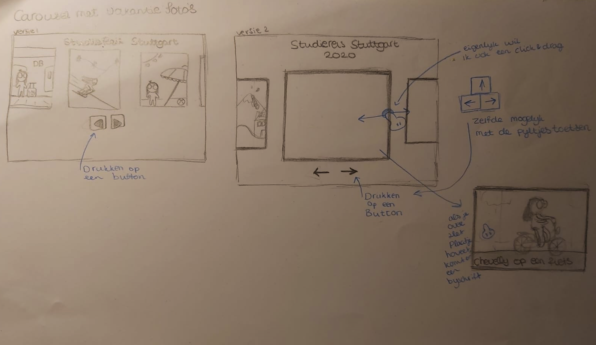
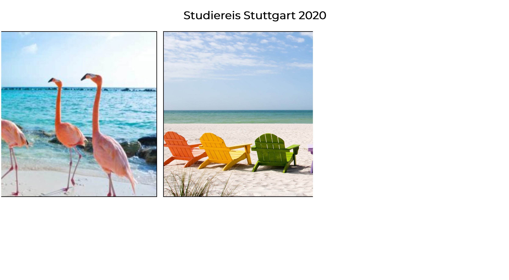

# Frontend voor Designers - opdracht 2: Een interactie uitwerken voor verschillende gebruikers input

Ik heb gekozen voor een carousel met vakantiefoto's: Een carousel met meerdere foto's van een vakantie, die je kan bedienen met een button en met de pijltjes op het toetsenbord.

## Stap 1: Schetsen van de interactie

Eerst ben ik begonnen met een schets te maken van hoe ik dit voor me zou zien in een browser. Ik kwam al snel met het idee dat ik een carousel wilde dat het gehele scherm vulde. Het zou met de pijltjestoetsen of knoppen onder het carousel bediend kunnen worden.

Ik wilde ook een click en drag om door de foto's te navigeren. Eerst maar eens kijken of het lukt met knopjes/pijltjes toetsen.

## stap 2: Opstellen van de html

Ik vond het best wel lastig om te bedenken hoe ik de elementen zou plaatsen binnen de html. Met klasgenoten zijn we erachter gekomen dat we het beste een ul konden aan maken als een soort "container", met daarin de li's, wat de foto's zouden worden.

De afbeeldingen gaan wel al netjes naast elkaar, maar verlaten de viewport waardoor je een horizontale scroll krijgt. Dat is niet helemaal de bedoeling, maar met een beetje googelen vond ik "overflow-x: auto", waardoor er nu als het ware in de ul wordt gescrolt, en niet in de body.

## stap 3: Vormgeven met css

Nu was ik echt klaar om te beginnen met de css. Ik heb een font-family toegevoegd, heb de kleuren gebruikt die Spotify ook gebruikt en er zijn nu verschillende liedjes te zien in plaats van alleen Ariana Grande. De grote rode pijltjes heb ik kleiner gemaakt, in het playlist item gezet en van kleur veranderd. 

Ik vond de pijltjes die ik had gemaakt in de css wel leuk, maar wilde eigenlijk gebruik maken van html symbols. Dit had ik nog niet eerder gedaan, dus de website van https://www.toptal.com/designers/htmlarrows/ was heel handig en gemakkelijk te gebruiken. 

## stap 4: Interactie met Javascript

De Javascript stap vond ik een moeilijke stap. Ik vond het in leerjaar 1 ook vrij lastig. Dit was een drempel waar ik overheen moest om gewoon te gaan beginnen. Ik wist nog hoe ik vars moest aanmaken en oproepen dus dat was al een begin. Sanne heeft geholpen met de "querySelectorAll" tag, waardoor ik in een keer alle li buttons kon aanroepen om te gebruiken. Deze tag kende ik nog niet dus dat was fijn!

Door middel van de sortable plugin heb ik de unordered list (de playlist) drop & drag proof gemaakt. https://github.com/SortableJS/Sortable
Eigenlijk was dit wat ik in het begin al heel graag wilde. Maar nu werkten mijn pijltjes nog steeds niet. Dat was de volgende uitdaging.
Ik wist eigenlijk niet waar ik beginnen moest. Sanne kwam er bij zitten was heel behulpzaam. Hij gaf een indicatie van wat ik kon typen, vroeg of ik begreep wat ik typte en wat er dan zou gebeuren. Dit proces hebben we een aantal keer doorlopen en zo ben ik tot mijn clickable pijltjes gekomen.
Ik had nog nooit gebruik gemaakt van "parentNode" maar na een uitleg van Sanne begrijp ik nu wat dat betekent/doet. Hetzelfde verhaal voor previousElementSibling. Door het te vergelijken met een stamboom (vandaar mijn opa/broertje comments in de js) begreep ik makkelijker wat er gebeurde in de javascript.

Als laatste was dan de uitdaging om de bovenste/onderste knop te disabelen als het liedje al helemaal bovenaan/onderaan staat. 
Als de richting van het liedje gelijk staat aan "op", (dus een click op de bovenste pijl button) moet hij het vorige liedje erbij pakken. Als het vorige liedje er niet is, dan komt er dus niks. Als het vorige liedje wel bestaat, dan moet hij het vorige liedje voor het huidige liedje plakken. Dit hebben we gemaakt door insertBefore te gebruiken. 

Als laatste heb ik nog mijn pijltjes veranderd want die waren niet te zien. Het zijn nu gewoon buttons met een pijltje erin.

## Final result

Drag en drop/volgorde klikken screenshotten was wat lastig, maar ik heb hier iniedergeval twee screenshots met een andere volgorde om te laten zien hoe het zou werken. 
