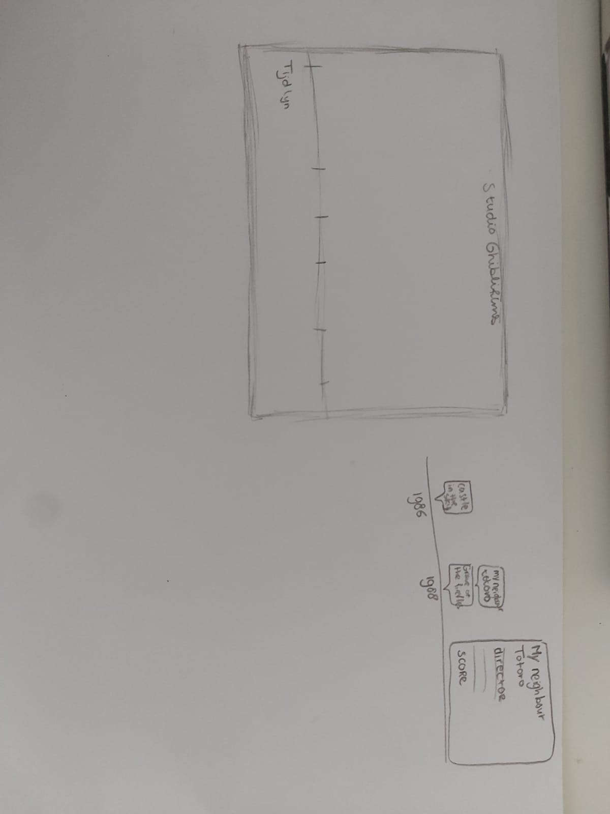
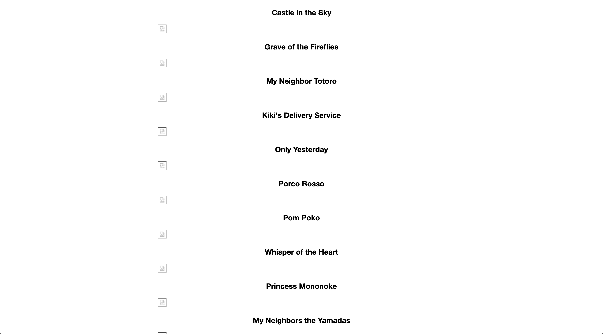
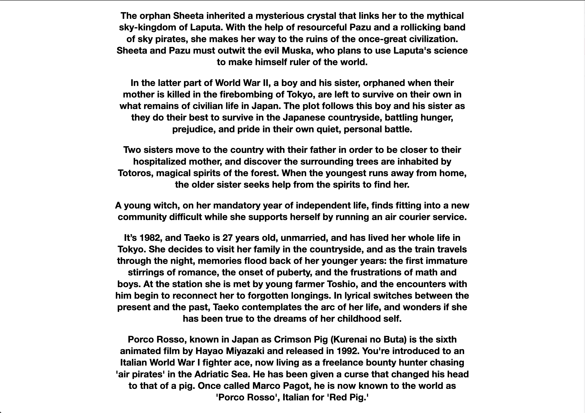
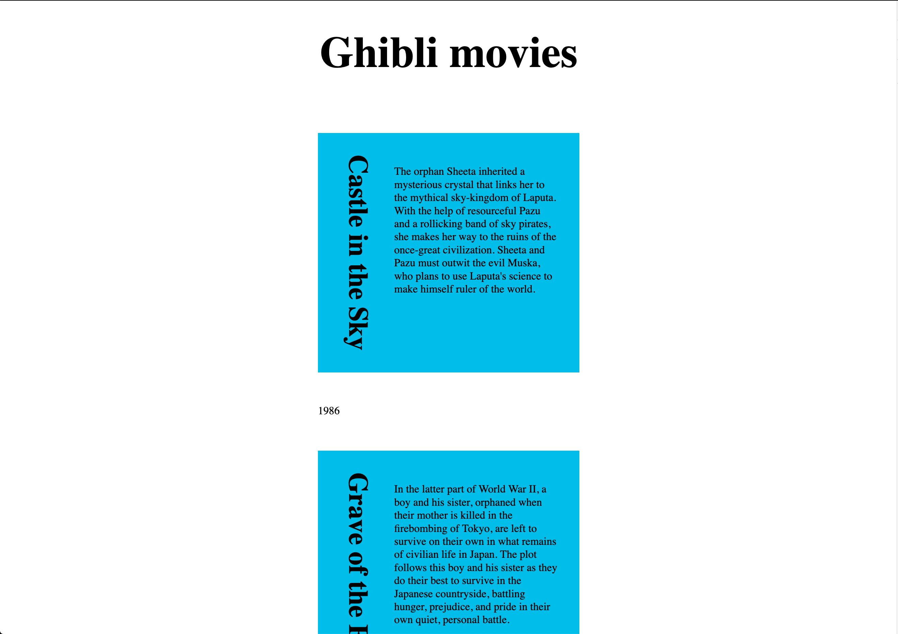
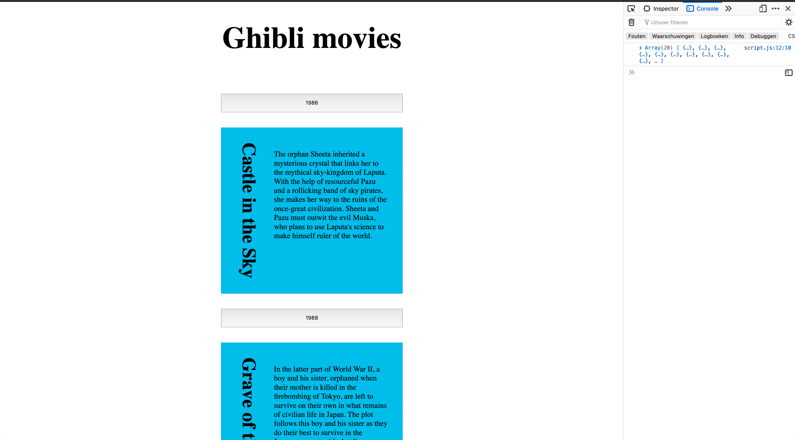
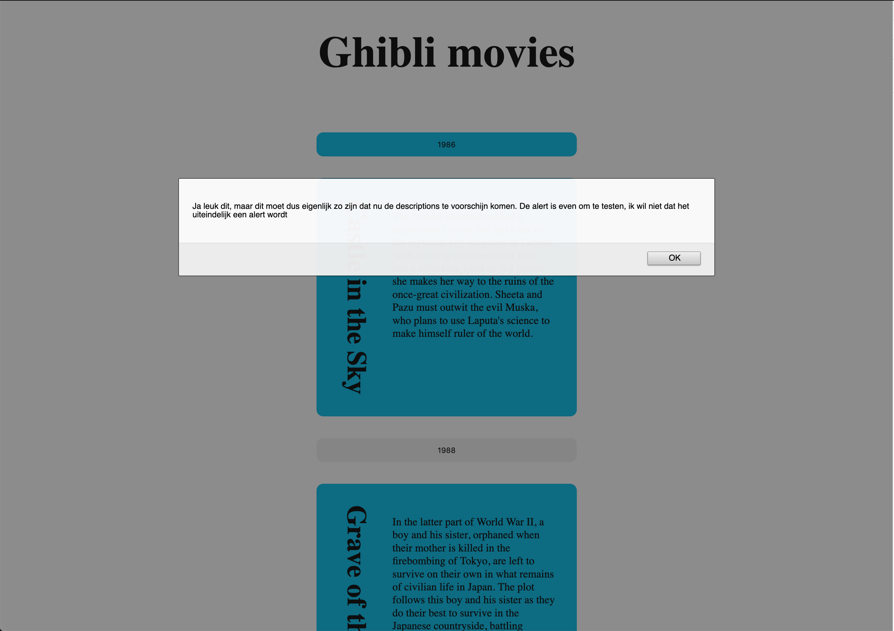
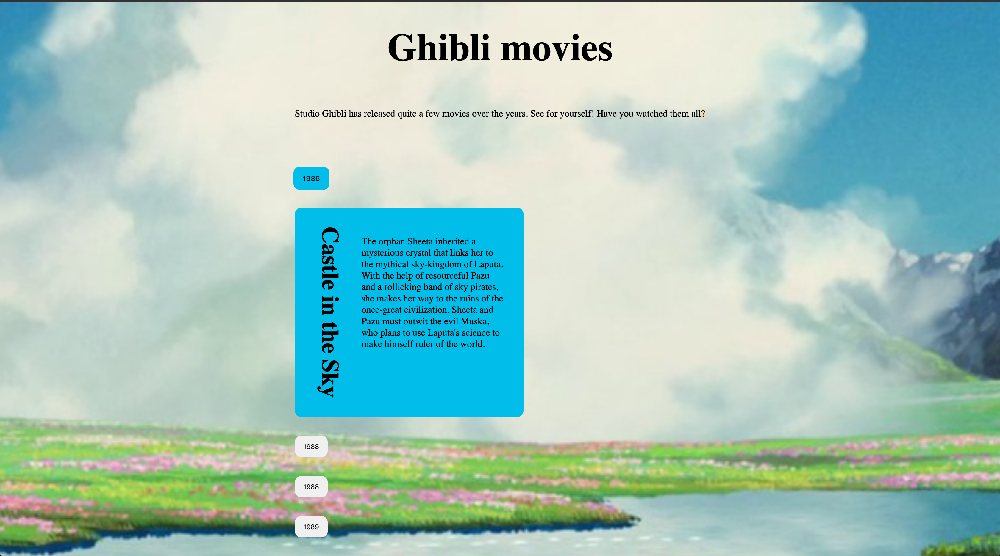

# Linkje 

https://gewooncerys.github.io/frontend-voor-designers-1920/opdracht3/

# Vragen

Hi Sanne! Thanks voor je codepens. Ik ben eruit gekomen met de javascript codepen. Niet ideaal zoals je zelf zegt met display:none, maar op de manier van de link die je mee stuurde werkt het niet. Dan blijft de datum ingeklapt maar krijg ik hem niet uitgeklapt. Ik wilde je eerder mailen, maar toen kregen andere opdrachten voorrang en nu is het opeens vrijdag. Er zitten te weinig dagen in 1 week. ;) 

Er gebeuren nu drie dingen in de code die niet moeten gebeuren en/of uberhaupt niet gebeuren. 

1. De achtergrond verspringt als ik op een jaartal klik. Ik weet wel waarom, maar ik wil het niet. De achtergrond moet gewoon vast staan anders is het zo lelijk haha. Maar ik weet niet hoe ik dat kan aanpassen. De achtergrond staat nu op "cover", wat daar denk ik voor zorgt. Maar als ik Contain doe werkt het ook niet lekker. Hoe kan ik dit aanpakken?

Toen dacht ik oke! Ik ga dit laten liggen en verder met het volgende. Maarja, toen liep ik daar ook weer tegen dingen aan:

2. Het animeren van de click lukt niet. Ik was er al een tijdje mee bezig en toen zag ik jouw codepen van iets laten bewegen. Dat is wat ik wilde! Dus die heb ik nagedaan (ik zag het ook al voorbij komen via css-tricks, net anders maar zelfde principe) maar hij animeert bij mij niet. Ik dacht misschien omdat articles niet kunnen animeren? Dat probeerde ik op te zoeken maar kon niet het antwoord vinden. Hoe kan ik dit aanpakken?

Toen dacht ik opnieuw oke! Ik ga dit laten liggen en verder met het volgende. Maarja, toen liep ik daar ook weer tegen dingen aan:

3. Ik heb de sortable plugin op het moment zodat iemand zijn films in een watchlist kan stoppen. De lijst is er wel, maar is onzichtbaar? Ik heb het samen met Gerben gedaan en bij hem werkt het wel en bij mij niet. We komen er niet uit samen. Hij is onzichtbaar, maar als ik de jaartallen uit klap (en dus de hidden articles tevoorschijn haal) is hij nog steeds onzichtbaar. Ik kan er wel dingen in slepen. Hoe kan ik dit aanpakken?

# frontend voor designers - opdracht 3: Een interactie uitwerken met externe data

Samen met May heb ik een API van Ghibli films uitgekozen. Die vond ik wat leuker dan de films die ik via de slides had. Mijn idee is om een tijdlijn te maken van de Ghibli films op jaartal waarop ze zijn uitgekomen. Wanneer je op een film klikt krijg je info over wanneer de film is uitgekomen, wie de director is en dart soort dingen.

## Stap 1: Schetsen van de interactie

Eerst ben ik begonnen met een schets te maken van hoe ik dit voor me zou zien in een browser.

## stap 2: Opstellen van de html

Het opstellen van de html ging vrij gemakkelijk met de tutorial, het was namelijk gewoon knippen plakken.

De namen van de films staan er verticaal, maar die wil ik horizontaal.
Ook heb ik nog staan dat ik images wil oproepen, maar die zitten niet in deze api.

Om te kijken of ik nog wist wat er gebeurde heb ik de namen weggehaald en er descriptions van gemaakt. Dit werkt, dus nu wil ik een eventlistener aanmaken waardoor als je op een titel klikt je de bijbehorende description krijgt. Maar ik weet even niet zo goed waar ik dan mee moet gaan beginnen.

## stap 3: Vormgeven met css
Hier ga ik me iets later op focussen. Ik wil voor nu dat de javascript enigszins werkt.
 

## stap 4: Javascript

Door de hulp van Sanne ben ik iets verder gekomen omdat ik nu weet hoe ik kan stylen in css. Wat ik nu wil gaan proberen is dat de jaartallen klikbaar worden. Wanneer een gebruiker hierop klikt, wil ik dat de blauwe blokken pas tevoorschijn komen. Ik heb nu wel een event listener die je een pop up geeft, maar dat is niet wat ik wil. Hierdoor weet ik in principe dat de click werkt, alleen moet de functie dus anders worden.

Ik had gekeken bij Sebastiaans codepen. Hij heeft een click op de gehele article, waardoor je de description ziet. Dit is eigenlijk ook wat ik wil. Ik wil dat als je op de jaartallen klikt, de description en title tevoorschijn komen. Ik probeerde zijn code te begrijpen door mijn code erop toe te passen, maar hierdoor raakte ik juist meer in de war (oeps). Ik snap wel het principe, maar dingen zoals "substring" ken(de) ik niet. Hoe meer ik las hoe meer ik zag dat er steeds meer dingen gebeurde zoals "vulmetbasics" en "vulmetdetails" - snap er gewoon even niks meer van.

Ik vind het erg lastig omdat ik niet gewend ben om te werken met data die je ergens ophaalt. Ik ben gewend dat er in de html elementen staan die ik vervolgens aanpas. Nu alles in de javascript gebeurd vind ik het erg verwarrend en weet ik niet waar ik moet beginnen.

 Ik kwam erachter dat ik eigenlijk al best ver was met de oplossing voor het verstoppen van de articles. Nouja, ik dacht op de juiste manier. De uitwerking was minder. Ik heb op het moment de click met display none. Inderdaad niet prettig/handig voor screenreaders, maar via de link die je stuurde kreeg ik het niet aan de praat. Toen werd hij ingeklapt, maar niet meer uitgeklapt.

Ik heb nu eindelijk ook een achtergrond toegevoegd. Maakt al een verschil. Wat nu wel gebeurd is dat als je op een datum klikt, de achtergrond verspringt. Ik weet wel hoe dat komt, maar weet niet hoe ik het kan oplossen..

Ik ben nu aan de slag gegaan met sortable, omdat het animeren van een bepaald element (de article wanneer er geklikt wordt) nu even niet lukt. De plugin werkt zoals ik hem wil, alleen blijft de styling onzichtbaar. Kom er even niet uit waarom dat is? Het hoort niet in iedergeval. Als ik op een jaartal klik dan blijft hij alsnog verborgen, dus daar ligt het niet aan. Ik kan er wel dingen inslepen.

